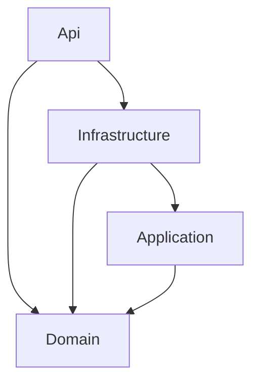
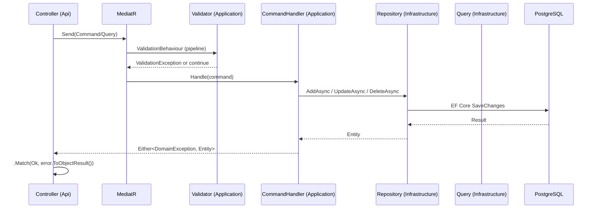

# AI_CONTEXT.md — ToolSnap Backend API

> Auto-generated architectural documentation for AI coding assistants.
> Based on static analysis of the solution. Last updated: 2026-05-16.

---

## Solution Overview

| Field | Value |
|-------|-------|
| **System Name** | ToolSnap Backend API |
| **Business Domain** | Tool inventory management — issuance, return, and photo-based AI detection of tools |
| **Architecture** | Clean Architecture + CQRS (Command Query Responsibility Segregation) |
| **Framework** | ASP.NET Core 10.0 |
| **Database** | PostgreSQL 17 via Npgsql + Entity Framework Core 10 |
| **AI Integration** | Google Gemini 2.5 Flash Lite (tool detection from photos) |

### Main Responsibilities

- Track physical tools (inventory, status, serial numbers)
- Issue and return tools to/from users with geolocation
- Document tool photos and run AI-powered detection
- Manage users, roles, locations, and photo sessions
- Generate and validate JWT access + refresh tokens

---

## Solution Structure

```
ToolSnap/
├── src/
│   ├── Api/               ← REST API layer (Controllers, DTOs, Filters, Validators, Services, Modules)
│   ├── Application/       ← Business logic (CQRS Commands, Validators, Interfaces, Settings)
│   ├── Domain/            ← Core entities, strong-typed IDs, domain methods
│   └── Infrastructure/    ← EF Core, Repositories, Queries, JWT, File Storage
├── ToolSnap.slnx          ← Solution file (new slnx format)
└── README.md
```

### Project Responsibilities

| Project | Role | Key Dependencies |
|---------|------|-----------------|
| `Domain` | Pure domain model — no framework dependencies | BCrypt.Net-Next (password hashing only) |
| `Application` | CQRS commands/queries, interfaces, validators, pipeline behaviors | MediatR 14, FluentValidation 12, LanguageExt.Core 4.4 |
| `Infrastructure` | EF Core, Npgsql, repos, queries, JWT generator, file storage | EFCore, Npgsql, System.IdentityModel.Tokens.Jwt |
| `Api` | REST controllers, DTOs, error mapping, Swagger, DI wiring | FluentValidation, JwtBearer, Swashbuckle, Newtonsoft.Json |

### Project Reference Graph



---

## Tech Stack

| Category | Technology | Version |
|----------|-----------|---------|
| Runtime | .NET | 10.0 |
| Web framework | ASP.NET Core | 10.0 |
| ORM | Entity Framework Core + Npgsql | 10.0.2 / 10.0.0 |
| CQRS mediator | MediatR | 14.0.0 |
| Validation | FluentValidation | 12.1.1 |
| Functional types | LanguageExt.Core | 4.4.9 |
| Password hashing | BCrypt.Net-Next | 4.0.3 |
| Authentication | Microsoft.AspNetCore.Authentication.JwtBearer | 10.0.3 |
| JWT tokens | System.IdentityModel.Tokens.Jwt | 8.16.0 |
| JSON | Newtonsoft.Json | 13.0.4 |
| API docs | Swashbuckle.AspNetCore | 10.1.4 |
| DB naming | EFCore.NamingConventions | 10.0.1 |
| DB driver | Npgsql | 10.0.1 |
| AI service | Google Gemini API | 2.5-flash-lite |
| File storage | Local filesystem | — |

---

## Architecture

### Layer Interaction



### Dependency Flow (strict)

```
Api → Infrastructure → Application → Domain
Api → Domain (DTOs access entities)
```

No reverse dependencies. Domain has zero framework references.

### DI Container Structure

```
Program.cs
├── services.SetupServices(config)          ← Api layer DI
│   ├── AddControllers (+ ValidationFilter, ValidationExceptionFilter)
│   ├── AddCors
│   ├── AddRequestValidators               ← DTO-level validators
│   ├── AddApplicationSettings             ← JwtSettings, ApplicationSettings
│   └── AddControllerServices              ← 17 IXxxControllerService registrations
├── services.AddApplicationServices()      ← Application layer DI
│   ├── AddValidatorsFromAssembly          ← FluentValidation (all validators)
│   ├── AddMediatR                         ← All command/query handlers
│   └── AddTransient<IPipelineBehavior<,>, ValidationBehaviour<,>>
└── services.AddInfrastructureServices()   ← Infrastructure layer DI
    ├── AddPersistenceServices
    │   ├── AddDbContext<ApplicationDbContext> (Npgsql + snake_case)
    │   ├── AddScoped<ApplicationDbContextInitialiser>
    │   └── AddRepositories (16+ repos + 16+ queries)
    ├── AddFileStorageServices             ← LocalFileStorage
    └── AddAuthenticationServices          ← JwtTokenGenerator
```

### Request Lifecycle

1. HTTP request arrives at controller action
2. `ValidationFilter` (action filter) runs DTO validators before handler
3. Controller calls `_mediator.Send(command)` or `_mediator.Send(query)`
4. MediatR pipeline: `ValidationBehaviour` validates command via FluentValidation
5. Handler executes — calls repository (write) or query (read)
6. Handler returns `Either<DomainException, Entity>`
7. Controller `.Match()` converts to `ActionResult<Dto>` or `ObjectResult` (error)
8. Error factory extension methods map domain exceptions to HTTP status codes

---

## Core Business Modules

### Tool Inventory

- `Tool` entity: has type, brand, model, serial number, status, photos
- `ToolStatus`: tracks lifecycle state (e.g., Available, Issued, Maintenance)
- `ToolType`, `Brand`, `Model`: classification hierarchy
- `ToolPhoto`: attached photos, stored on local filesystem

### Tool Assignment (Issuance/Return)

- `ToolAssignment`: core workflow — links tool to user at a location with action type
- `ActionType`: "Issue" or "Return" (data-driven, not enum)
- `is_active` flag: marks if tool is currently issued
- `returned_at`: populated when returned
- `CreateWithAssignment` command: atomic creation of tool + first assignment

### Photo Sessions & AI Detection

- `PhotoSession`: groups photos taken in a session (user + action + location + photo type)
- `PhotoForDetection`: individual images stored as bytes + file path
- `DetectedTool`: result of Gemini AI analysis — detected tool type/brand/model + confidence
- `GeminiService`: calls `generativelanguage.googleapis.com` with base64 images and structured prompt

### User & Authentication

- `User`: identity with role, email confirmation flag, geolocation, BCrypt password, refresh token
- `Role`: simple named role associated with user
- JWT access token (15–60 min) + refresh token (7 days)
- Refresh token stored on `User` entity in DB (not a separate table)

### Geolocation

- `Location` entity: named location with lat/lon and type (e.g., warehouse, job site)
- `User.Latitude/Longitude`: user's last known position
- `ToolAssignment` references `Location` for issuance/return tracking

---

## Database Layer

### DbContext

| File | Path |
|------|------|
| `ApplicationDbContext` | `src/Infrastructure/Persistence/ApplicationDbContext.cs` |
| `IApplicationDbContext` | `src/Application/Common/Interfaces/IApplicationDbContext.cs` |
| Initializer | `src/Infrastructure/Persistence/ApplicationDbContextInitialiser.cs` |

- 17 `DbSet<T>` properties
- FluentAPI configurations in `Configurations/` (19 config classes)
- `ApplyConfigurationsFromAssembly()` — auto-discovers all `IEntityTypeConfiguration<T>`
- `UseSnakeCaseNamingConvention()` — all column/table names are snake_case automatically
- `BeginTransactionAsync()` exposed for cross-repository transactional operations
- Runs `MigrateAsync()` on startup via `ApplicationDbContextInitialiser`

### Entity Configuration Pattern

Each entity has its own `*Configurations.cs` file in `Infrastructure/Persistence/Configurations/`.
Uses EF Core Fluent API (no Data Annotations on domain entities).

### Tables

| Table | Key Columns |
|-------|-------------|
| `roles` | id, title |
| `users` | id, full_name, email, confirmed_email, role_id, password_hash, is_active, created_at, latitude, longitude, refresh_token, refresh_token_expiry_time |
| `locations` | id, title, latitude, longitude, location_type_id, is_active |
| `location_types` | id, title, is_active |
| `tool_types` | id, title |
| `brands` | id, title |
| `models` | id, title, brand_id |
| `tool_statuses` | id, title |
| `tools` | id, tool_type_id, brand_id, model_id, serial_number, tool_status_id, created_at |
| `tool_photos` | id, tool_id, photo_path, created_at |
| `photo_types` | id, title |
| `action_types` | id, title |
| `photo_sessions` | id, user_id, action_type_id, location_id, photo_type_id, created_at |
| `photos_for_detection` | id, photo_session_id, file_path, file_name, content (bytes) |
| `tool_assignments` | id, tool_id, user_id, action_type_id, location_id, photo_session_id, is_active, created_at, returned_at |
| `detected_tools` | id, photo_for_detection_id, tool_type_id, brand_id, model_id, confidence, red_flagged |

### Repositories

Pattern: `AddAsync`, `UpdateAsync`, `DeleteAsync` only (no generic base class).
16 repository classes, each registered as `scoped`.
No generic repository base — intentional, each repo is specific.

### Queries

Separate from repositories — read-only EF Core queries.
16+ query classes with methods like `GetAllAsync`, `GetByIdAsync`, `GetByTitleAsync`.
Return `IReadOnlyList<T>` or `Option<T>` (LanguageExt).

### Migrations

| File | Description |
|------|-------------|
| `20260221151010_Innitial.cs` | Single initial migration — creates all tables |
| `ApplicationDbContextModelSnapshot.cs` | EF model snapshot |

Only one migration exists — the project is in early development stage.

### Transaction Handling

`IApplicationDbContext.BeginTransactionAsync()` exposed for multi-step operations.
Used explicitly in complex commands like `CreateToolWithAssignment`.
Most operations rely on `SaveChangesAsync()` per repository call (single entity).

---

## API Layer

### Controllers (18 total)

All controllers in `src/Api/Controllers/`. All use `[ApiController]` + `[Route("[controller]")]`.

| Controller | Resource | Notable Endpoints |
|------------|----------|-------------------|
| `AuthController` | `/auth` | Login, Register, RefreshToken, RevokeToken |
| `UsersController` | `/users` | CRUD + confirm-email, activate, deactivate, change-password |
| `ToolsController` | `/tools` | CRUD + search-available, not-returned, create-with-assignment, change-status |
| `ToolAssignmentsController` | `/toolassignments` | CRUD + return |
| `PhotoSessionsController` | `/photosessions` | Create + get-files |
| `DetectedToolsController` | `/detectedtools` | CRUD + batch-create |
| `LocationsController` | `/locations` | CRUD + activate/deactivate |
| `BrandsController` | `/brands` | CRUD |
| `ModelsController` | `/models` | CRUD |
| `RolesController` | `/roles` | CRUD |
| `ToolStatusesController` | `/toolstatuses` | CRUD |
| `ToolTypesController` | `/tooltypes` | CRUD |
| `ActionTypesController` | `/actiontypes` | CRUD |
| `LocationTypesController` | `/locationtypes` | CRUD + activate/deactivate |
| `PhotoTypesController` | `/phototypes` | CRUD |
| `ToolPhotosController` | `/toolphotos` | CRUD |
| `PhotoForDetectionsController` | `/photofordetections` | CRUD |
| `AuthentificationController` | `/authentification` | (misspelled — appears to duplicate AuthController) |

> **Note:** Two authentication controllers exist (`AuthController` and `AuthentificationController`). This is likely technical debt — verify which is actually used.

### Response Pattern (all controllers)

```csharp
var result = await _mediator.Send(new XxxCommand(...));
return result.Match<ActionResult<XxxDto>>(
    entity => Ok(XxxDto.FromDomain(entity)),   // or CreatedAtAction for POST
    error  => error.ToObjectResult()           // extension method
);
```

### Error → HTTP Status Code Mapping

Each entity has a `*ErrorFactory.cs` in `src/Api/Modules/Errors/`:

```
EntityNotFoundException       → 404 Not Found
EntityAlreadyExistsException  → 409 Conflict
InvalidOperationException     → 400 Bad Request
UnhandledException            → 500 Internal Server Error
```

### Middleware Pipeline

```
UseAuthentication()
UseAuthorization()
UseRouting()
UseCors()
MapControllers()
[Swagger only in Development]
```

`ValidationFilter` (action filter) runs before any controller action body.

### Authentication

- JWT Bearer — `[Authorize]` attribute on protected endpoints
- Token structure: `sub`, `email`, `name`, `ClaimTypes.NameIdentifier`, `ClaimTypes.Role`, `role_id`, `is_active`, `email_confirmed`, `jti`
- `ClockSkew: TimeSpan.Zero` — tokens expire precisely at the stated time
- `RequireHttpsMetadata: false` — acceptable in development, **must be true in production**

### Validation

Two levels:
1. **DTO validators** (`src/Api/Modules/Validators/`) — run by `ValidationFilter` (action filter) before MediatR
2. **Command validators** (`src/Application/Entities/*/Commands/*Validator.cs`) — run by `ValidationBehaviour` inside MediatR pipeline

---

## Reporting System

No dedicated reporting system exists. The closest feature is:

- `PhotoSessionsController.GetPhotoFilesBySession` — retrieves all image files from a photo session
- `GeminiService.DetectToolsFromSessionAsync` — AI analysis that returns structured detection JSON

No PDF/Excel/report generation is present.

---

## Background Processing

**No background services (IHostedService) are present** in the current codebase.

The only startup-time operation is:
```csharp
await app.InitialiseDatabaseAsync(); // runs EF migrations via ApplicationDbContextInitialiser
```

No Hangfire, Quartz, or hosted background jobs exist.

---

## Configuration System

### Files

| File | Purpose |
|------|---------|
| `src/Api/appsettings.json` | Production template (placeholder connection string, non-dev JWT key) |
| `src/Api/appsettings.Development.json` | Local dev (real PostgreSQL connection, shorter JWT expiry) |
| `src/Api/Properties/launchSettings.json` | Dev launch profiles (ports 5029/7062) |

### Key Configuration Sections

```json
{
  "ConnectionStrings": {
    "DefaultConnection": "<postgres-connection-string>"
  },
  "Jwt": {
    "Secret": "<min-32-char-key>",
    "Issuer": "ToolSnapAPI",
    "Audience": "ToolSnapClient",
    "ExpirationMinutes": 60,
    "RefreshTokenExpirationDays": 7
  }
}
```

### Settings Classes

- `JwtSettings` — bound from `"Jwt"` section, registered as singleton
- `ApplicationSettings` / `ConnectionStrings` — supplementary config object

### Gemini API Key

The Gemini API key is read from `IConfiguration` directly in `GeminiService` (not bound to a typed settings class). There is **no dedicated `GeminiSettings` class**. Key must exist in config; absence causes runtime failure.

### No Docker / CI-CD

No `Dockerfile`, `docker-compose.yml`, or CI pipeline configs (`.github/workflows`, `azure-pipelines.yml`) were found. The README mentions Docker for the database only.

---

## Coding Conventions

### Naming

| Construct | Convention | Example |
|-----------|-----------|---------|
| Classes | PascalCase | `ToolAssignmentRepository` |
| Interfaces | `I` prefix + PascalCase | `IToolAssignmentRepository` |
| Commands | `{Action}{Entity}Command` | `CreateToolAssignmentCommand` |
| Handlers | `{Command}Handler` | `CreateToolAssignmentCommandHandler` |
| Queries (class) | `{Entity}Queries` | `ToolAssignmentQueries` |
| Query interface | `I{Entity}Queries` | `IToolAssignmentQueries` |
| Validators | `{Command}Validator` | `CreateToolAssignmentCommandValidator` |
| DTOs | `{Entity}Dto` | `ToolAssignmentDto` |
| Create DTOs | `Create{Entity}Dto` | `CreateToolAssignmentDto` |
| Update DTOs | `Update{Entity}Dto` | `UpdateToolAssignmentDto` |
| ID types | `{Entity}Id` | `ToolAssignmentId` |
| Config classes | `{Entity}Configurations` | `ToolAssignmentConfigurations` |
| Error factories | `{Entity}ErrorFactory` | `ToolAssignmentErrorFactory` |
| DB tables | snake_case (auto) | `tool_assignments` |
| DB columns | snake_case (auto) | `tool_status_id` |
| Private fields | `_camelCase` | `_mediator`, `_httpClient` |
| Async methods | `Async` suffix | `GetAllAsync`, `BeginTransactionAsync` |

### DTO Pattern

- DTOs are `record` types in `src/Api/DTOs/`
- Each DTO file contains multiple records: `XxxDto`, `CreateXxxDto`, `UpdateXxxDto` (and patches)
- Static factory: `XxxDto.FromDomain(Entity entity)` converts domain → DTO

### Entity Factory Pattern

```csharp
// All entities use static New() factory — no public constructors
public static Brand New(string title) =>
    new() { Id = BrandId.New(), Title = title.Trim().ToLower() };
```

### Error Handling

```csharp
// Domain exceptions hierarchy
public abstract class BrandException : Exception { }
public class BrandNotFoundException : BrandException { }
public class BrandAlreadyExistsException : BrandException { }
public class UnhandledBrandException : BrandException { }

// Handler returns Either
Either<BrandException, Brand> result = ...

// Controller maps to HTTP
result.Match(
    brand => Ok(BrandDto.FromDomain(brand)),
    error => error.ToObjectResult()
)
```

### Functional Programming Style

- `Either<TLeft, TRight>` — `TLeft` = exception, `TRight` = success value
- `Option<T>` — used in queries instead of returning null
- `.Match()` — pattern matching on result
- `Unit` — used as void return in LanguageExt context (file storage)

---

## AI Development Guidelines

### Adding a New Entity (Complete Workflow)

Follow this sequence exactly — all existing entities follow it:

1. **Domain** — `src/Domain/Models/{EntityGroup}/{Entity}.cs` + `{Entity}Id.cs`
2. **Domain exceptions** — `src/Domain/Models/{EntityGroup}/{Entity}Exceptions.cs`
3. **Application interfaces** — `src/Application/Common/Interfaces/Repositories/I{Entity}Repository.cs` + `Queries/I{Entity}Queries.cs`
4. **Application commands** — `src/Application/Entities/{Entity}/Commands/Create{Entity}Command.cs` (+ handler + validator), repeat for Update/Delete
5. **Infrastructure** — `src/Infrastructure/Persistence/Configurations/{Entity}Configurations.cs`
6. **Infrastructure** — `src/Infrastructure/Persistence/Repositories/{Entity}Repository.cs` + `Queries/{Entity}Queries.cs`
7. **Infrastructure** — Register in `ConfigurePersistenceServices.cs` → `AddRepositories()`
8. **Api** — `src/Api/DTOs/{Entity}Dto.cs`
9. **Api** — `src/Api/Modules/Validators/{Entity}Validators.cs`
10. **Api** — `src/Api/Modules/Errors/{Entity}ErrorFactory.cs`
11. **Api** — `src/Api/Controllers/{Entity}Controller.cs`
12. **Api** — Register controller service in `SetupModule.cs`
13. **Database** — Add new EF Core migration: `dotnet ef migrations add Add{Entity} --project Infrastructure --startup-project Api`

### Where Business Logic Belongs

| Type | Location |
|------|----------|
| Domain rules (invariants) | Entity methods in `Domain/Models/` |
| Orchestration logic | Command handlers in `Application/Entities/*/Commands/` |
| Cross-entity orchestration | Command handler + `IApplicationDbContext.BeginTransactionAsync()` |
| Query logic | Query classes in `Infrastructure/Persistence/Queries/` |
| HTTP mapping | Controllers in `Api/Controllers/` |
| DTO construction | `XxxDto.FromDomain()` static methods |

**Never put business logic in controllers.** Controllers only: call mediator → map result.

### Critical Files

| File | Why Critical |
|------|-------------|
| `src/Infrastructure/Persistence/ApplicationDbContext.cs` | All entity registrations — changes affect migrations |
| `src/Infrastructure/Persistence/ConfigurePersistenceServices.cs` | DI registration for all repos/queries — missing registration = runtime null ref |
| `src/Api/Modules/SetupModule.cs` | API-layer DI — missing registration = controller service failure |
| `src/Application/ConfigureServices.cs` | MediatR + validator assembly scan — wrong assembly = handlers not found |
| `src/Api/Program.cs` | Middleware ordering — wrong order breaks auth/validation |
| `src/Infrastructure/Persistence/Migrations/20260221151010_Innitial.cs` | Only migration — schema source of truth |

### Fragile Areas

1. **Duplicate auth controllers** (`AuthController` vs `AuthentificationController`) — unclear which is authoritative
2. **Gemini API key** — read raw from `IConfiguration`, no typed settings, no null guard
3. **Local file storage** — `uploads/` folder is relative path, no cloud fallback, no size/type validation on stored files
4. **Refresh token on User entity** — token stored in `users` table; concurrent refresh calls could cause race conditions
5. **Single migration** — adding many columns to existing tables will require care if data exists
6. **`RequireHttpsMetadata: false`** — must be verified and corrected before any production deployment
7. **JWT secret in appsettings.json** — the production file has a placeholder; real secret must come from environment variable or secrets manager

### Database Change Rules

1. Never edit migration files manually after they are created
2. Always run `dotnet ef migrations add <Name>` from the solution root with `--project` and `--startup-project`
3. The `ApplicationDbContextInitialiser` runs `MigrateAsync()` on startup — migrations apply automatically
4. EFCore.NamingConventions handles snake_case — do not add `[Column("snake_name")]` manually

### Pattern Preservation Rules

- All new queries must return `Option<T>` for single-result and `IReadOnlyList<T>` for lists
- All new commands must return `Either<DomainException, Entity>`
- All new entities must use strong-typed ID structs (e.g., `record struct ToolId(Guid Value)`)
- All new entities must use static `New()` factory, not public constructors
- All new validators must be `AbstractValidator<TCommand>` registered automatically via assembly scan

---

## Refactoring Opportunities

| Issue | Location | Risk | Suggestion |
|-------|----------|------|-----------|
| Duplicate auth controllers | `AuthController` + `AuthentificationController` | High | Remove one; verify which has correct implementation |
| Gemini key not in typed settings | `GeminiService.cs` | Medium | Add `GeminiSettings` class, bind from config |
| No base repository/query | All repos | Low | Consider `IRepository<T>` base if patterns fully converge |
| Refresh token race condition | `User` entity | Medium | Add optimistic concurrency or move to dedicated table |
| `RequireHttpsMetadata: false` | `Program.cs` | High | Enable for production; gate on environment |
| JWT secret in appsettings | `appsettings.json` | Critical | Move to environment variable / secrets manager |
| `photos_for_detection.content` stores raw bytes | DB table | Medium | Store only file path; bytes already on disk |
| No cloud file storage | `LocalFileStorage` | Low-Medium | Abstract further for future S3/Azure Blob migration |
| Single migration | Migrations/ | Low | As schema stabilizes, consider squashing |
| Typo: "Innitial" migration | `20260221151010_Innitial.cs` | Low | Cosmetic only — do not rename after migration is applied |
| No integration tests | Entire solution | Medium | Add xUnit + Testcontainers for PostgreSQL |
| No logging in handlers | Application layer | Low | Add `ILogger<T>` to handlers for structured logging |

---

## Important Entry Points

| File | Purpose |
|------|---------|
| `src/Api/Program.cs` | App bootstrap, DI wiring, middleware pipeline |
| `src/Api/Modules/SetupModule.cs` | API-layer service registrations |
| `src/Application/ConfigureServices.cs` | Application-layer service registrations |
| `src/Infrastructure/ConfigureInfrastructureServices.cs` | Infrastructure-layer service registrations |
| `src/Infrastructure/Persistence/ConfigurePersistenceServices.cs` | DB + repository registrations |
| `src/Infrastructure/Persistence/ApplicationDbContext.cs` | EF Core DbContext |
| `src/Infrastructure/Persistence/ApplicationDbContextInitialiser.cs` | Runs migrations on startup |
| `src/Api/Controllers/AuthController.cs` | Authentication endpoints |
| `src/Api/Controllers/ToolsController.cs` | Core tool management |
| `src/Api/Controllers/ToolAssignmentsController.cs` | Tool issuance/return workflow |
| `src/Api/Services/GemeniAiService/GeminiService.cs` | AI photo detection |
| `src/Infrastructure/Authentication/JwtTokenGenerator.cs` | Token generation |
| `src/Infrastructure/BlobStorage/BlobStorageService.cs` | File storage |

---

## Build & Run Instructions

### Prerequisites

- .NET 10 SDK
- PostgreSQL 17 (local or Docker)
- Google Gemini API key (for AI detection features)

### Database (Docker)

```bash
docker run --name toolsnap-db -e POSTGRES_PASSWORD=4321 -e POSTGRES_DB=toolsnap-db -p 5432:5432 -d postgres:17
```

### Configure

Edit `src/Api/appsettings.Development.json`:
```json
{
  "ConnectionStrings": {
    "DefaultConnection": "Server=localhost;Port=5432;Database=toolsnap-db;User Id=postgres;Password=4321;TimeZone=UTC"
  }
}
```

Set Gemini API key (exact config key TBD — check `GeminiService.cs`):
```bash
# Via environment variable (PowerShell)
$env:Gemini__ApiKey = "your-key-here"
```

### Build

```bash
dotnet build ToolSnap.slnx
```

### Run

```bash
dotnet run --project src/Api/Api.csproj
# API: https://localhost:7062
# Swagger: https://localhost:7062/swagger
```

Migrations run automatically on startup via `ApplicationDbContextInitialiser`.

### Add Migration

```bash
dotnet ef migrations add <MigrationName> \
  --project src/Infrastructure \
  --startup-project src/Api \
  --output-dir Persistence/Migrations
```

### Test

No test projects found in the solution. Tests need to be added.
